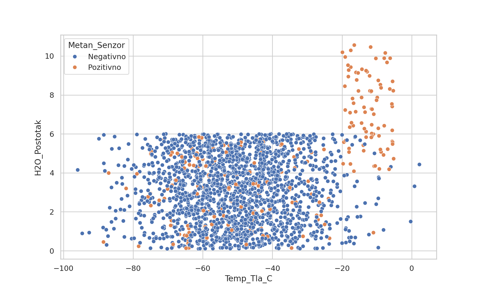
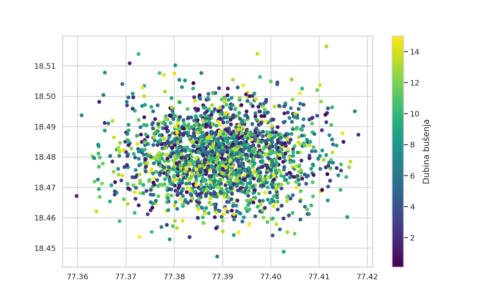
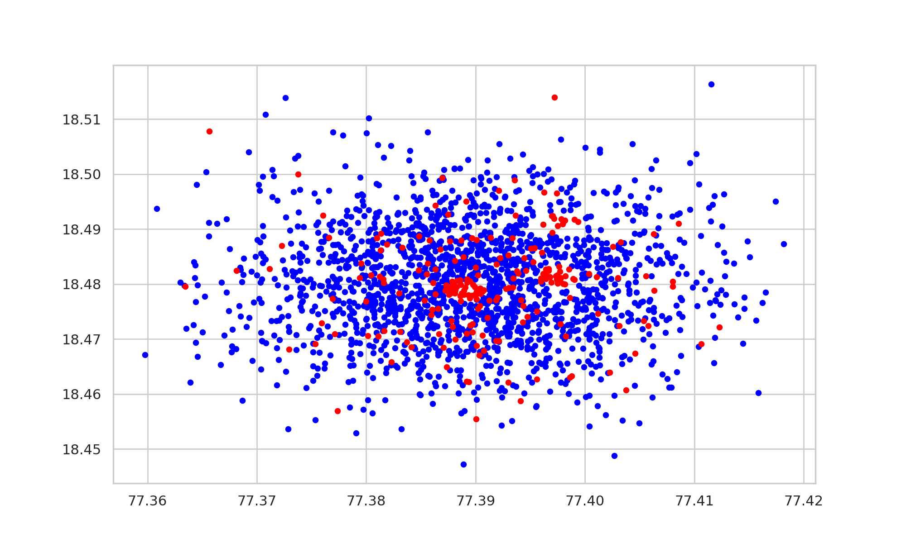
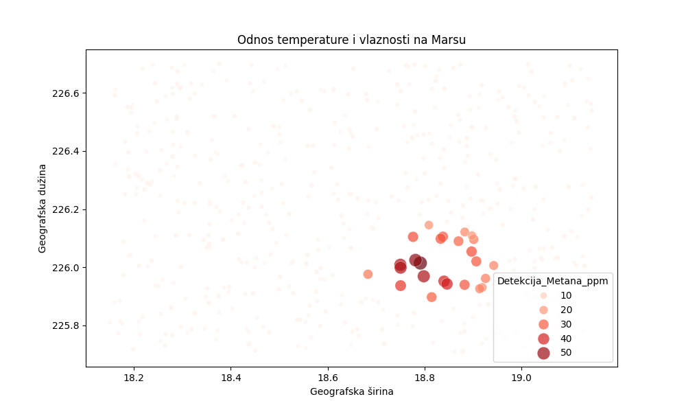
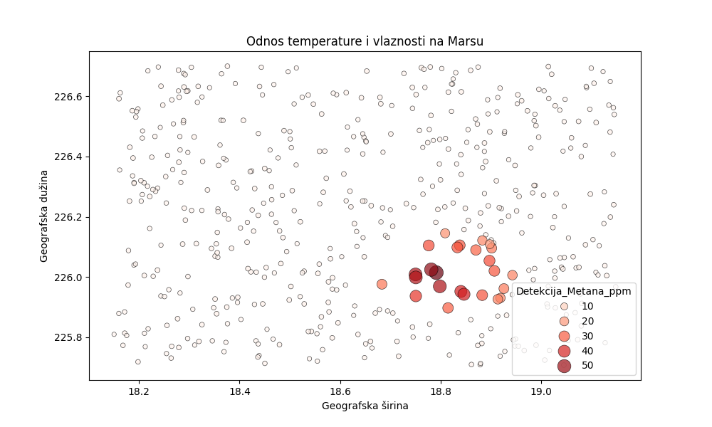

A
#Krater Jezero
Krater Jezero detaljno je analizirano kako bi se saznalo postoji li života na Marsu, to jest moglo bi li se jednog dana preseliti na Mars.
U analizi se koriste strukturirani ulazni podaci prikupljeni senzorima i instrumentima,uključujući identifikator uzorka, dubinu bušenja,
temperaturu tla, pH vrijednost, postotak vode, očitanja metanskog senzora, prisutnost organskih molekula, GPS koordinate, temperaturu okoliša, vlažnost tla te koncentraciju metana u ppm.
Obradom tih podataka procjenjuje se mogućnost života na Marsu, te se roveru omogućuju sigurne rute kretanja.

B
#Pojašnjenje koda
1. Modeliranje binarnih i kategoričkih varijabli (metan i organske tvari)

Vrijednosti poput prisutnosti metana i organskih tvari generirane su pomoću uvjetnih vjerojatnosti:

-Metan: 80–90% slučajeva pozitivno, ovisno o random pragovima
-Organske tvari: ~80% pozitivnih vrijednosti

Ovakav pristup simulira realnu prirodnu distribuciju gdje pozitivni nalazi dominiraju, ali postoje povremeni izuzeci.

Dodatno, uveden je mali postotak “šumnih” podataka (1% slučajeva) koji umjetno generiraju lažno pozitivne vrijednosti.
Time se modelira:

-mjerni šum senzora
-pogreške u detekciji
-anomalni uzorci u okolišu

2. Prostorno-klastersko modeliranje

Podaci su organizirani u tri jasno definirana klastera:

-Delta (bliže centru, sedimentno područje)
-Vallis (udaljeniji kanalni sustav)
-Crater Rim (dublje i stijensko područje)

Svaki klaster ima:

-pomak u koordinatama (lat/lon offset)
-različit broj uzoraka (count)
-opis okolišnih uvjeta

Koordinate se generiraju pomoću normalne distribucije:

-np.random.normal(...) osigurava realističnu prostornu disperziju
-centralna točka klastera definira “geološku zonu”

Ovo sprječava uniformnu distribuciju i uvodi prirodnu prostornu korelaciju podataka.

3. Uvjetno generiranje okolišnih varijabli

Za svaki klaster definiraju se specifične distribucije:

-Delta: plitki sedimenti, veća vlaga
  -manja dubina
  -veći H₂O sadržaj
-Vallis: srednje dubine, umjerena vlaga
  -srednje vrijednosti dubine i vlage
-Crater Rim: duboko, stijensko područje
  -veće dubine
  -niža vlaga, ali stabilniji uvjeti

Ovaj dio implementira geološku logiku u statističku simulaciju, što povećava realističnost modela.

4. Modeliranje senzorskog šuma (temperatura i pH)

Temperatura i pH vrijednosti generirani su kroz normalnu distribuciju:

-temperatura: np.random.normal(...)
-pH: np.random.normal(7.0, 0.2, count)

Ovo predstavlja:

-prirodne varijacije okoliša
-senzorski šum (measurement noise)

Standardna devijacija kontrolira razinu fluktuacije, čime se simulira realna nesigurnost mjerenja.

5. Logika dizajna (zašto ovakav pristup)

Ovaj pristup je odabran jer:

-omogućuje kontrolirano uvođenje šuma
-zadržava statističku realističnost
-osigurava prostornu i okolišnu korelaciju varijabli
-omogućuje testiranje robusnosti analitičkih modela (npr. detekcija anomalija)

C
#Pojašnjenje grafova

[]
Na ovom grafu vidimo postotak vode, temperaturu tla i prisutnost metana.
Najviše točkica to jest dobrih rezultata izažslo je iz točkica koje se nalaze na
H2O postotku između 0% i 6%, te temperaturi tla između -80C i -20C.
U tom području metan je ponajviše negativan. Pozitivni metan je najzastupljeniji na temperaturi
od -20C i 0C te H2O postotku od 4% do 10%

[]
Na ovom grafu vidimo odakle su zadovoljavajući uzorci došli.
Najviše ih je došlo sa koordinatama između 18.47 i 18.49 LON te
77.38 i 77.40 LAT i na dubini između 6 i 10 metara

[]
Na ovom grafu vidimo prisutnost metana na određenim koordinatama, najveća prisutnost metana
je na koordinatama između 18.47 I 18.49 LON te 77.38 i 77.40 LAT. Koordinate bez prisutnosti
metana su najčešce na koordinatama 18.48 LON,77.39 LAT i 18.48 LON,77.397 LAT.

[]
Na ovom grafu vidimo na kojim je koordinatama metan najviše zastupljen u ppm.
Koordinate sa preko 50 ppm metana se sve vrte oko 226.0 LON i 18.7 LAT

[]
Ovaj graf je skoro isti kao i prošli, samo u ovom su rubovi točkica podebljani i 
to nam omogućava da lakše očitamo koordinate i da vidimo i točkica sa manjom prisutnosti metana.

D
#JSON

    paket = {
        "projekt": "Nexus",
        "posiljatelj": "Mate Udovicic",
        "vrijeme": str(datetime.datetime.now()),
        "meta": {
            "uzorak_id": int(id_palete),
            "lokacija": {
                "lat": lat,
                "lon": lon
            }
        }
        },
    senzori: {
            "dubina_busenja": dubina,
            "temperatura": temp,
            "ph_vrijednost": ph,
            "vlaga": vlaga,
            "metan_senzor": metan,
            "organske_molekule": organske,
            "status": "PRIORITET" if hitno else "NORMALNO"

Ovdje je prikaz korištenih JSON podataka za ovu misiju.
Paket je strukturiran na dvije glavne cjeline, na paket i meta podatke
te senzore.Umjesto ručnog pisanja svakog senzora (hardcoding), koristi se petlja nad kolekcijom senzora.
Prednosti:
- Skalabilnost – lako dodavanje novih senzora
- Manje grešaka – nema ponavljanja koda
- Fleksibilnost – dinamičko generiranje paketa
- Održavanje – jednostavne izmjene na jednom mjestu

-Paket je modularan i ugniježđen 
-Jasno razdvaja metapodatke i senzorske podatke
-Petlje omogućuju automatizaciju i skalabilnost sustava

E
#Greške i postupci ispravljanja

1.Neispravno zaokruživanje vrijednosti(np.round)
PROBLEM
Skripta se rušila prilikom generiranja DataFrame-a za mjerenja zbog pogrešnog korištenja
np.round() na cijelom nizu s različitim decimalnim mjestima
UZROK
Funkcija nije podržavala različite preciznosti za elemente niza.
Kada je pogrešno korišteno da se vrijednosti zaokruživaju u cijelom nizu a ne pojedinačno
dolazilo je do ValueError
KORACI RJEŠAVANJA
  1.Provjerio sam traceback poruku i identificirao liniju s np.round()
  2.Pregledao sam dokumentaciju: np.round(a,decimals), očekuje skalarni decimals.
  3.Ispravio sam pozive taki da se za svaki niz koristi odgovarajući broj decimala.
  4.Dodao sam np.clip() za pH vrijednosti kako bi bile u fizički mogućem rasponu(0-14)
  5.Testirao sam generiranje DataFrame-a na 2000 uzoraka
REZULTAT
Skripta se uspješno izvršava.DataFrame s mjerenjima se ispravno generira
bez grešaka.Vrijednosti su zaokružene odgovarajućom preciznošću.

2.Neujednačena dužina nizova pri izgradnji DataFrame-a
PROBLEM
Pojavila se pogreška: ValueError:all arrays must be of the same lenght, prilikom
kreiranja DataFrame-a za lokacije ili mjerenja.
UZROK
Nizovi u rječniku koji se predaje pd.DataFrame() nisu imali istu duljinu.
Najčešći uzrok:pogrešno korištenje range ili generiranje pojedinih stupaca s različitim n_rows
KORACI RJEŠAVANJA
  1.Ispisao sam duljine svih nizova prije kreiranja DataFrame-a i uočio problem.
  2.Uvijek sam koristio isti n_rows za sve generatore.
  3.Standardizirao sam generiranje ID_Uzorka: range(1,n_rows + 1)
  4.Ponovno sam generirao sve nizove i izgradio DataFrame.
REZULTAT
Svi stupci imaju istu duljinu(2000).DataFrame se uspješno kreira i sprema bez pogrešaka.

